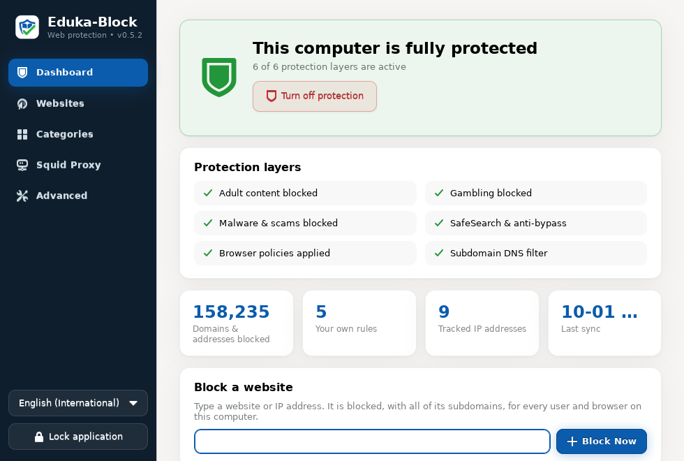
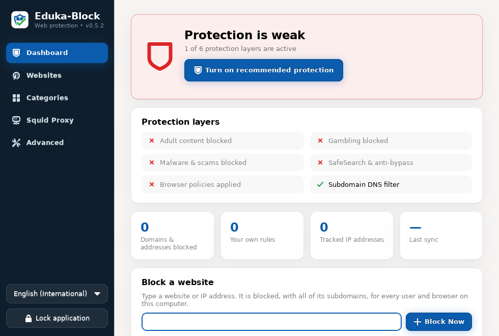
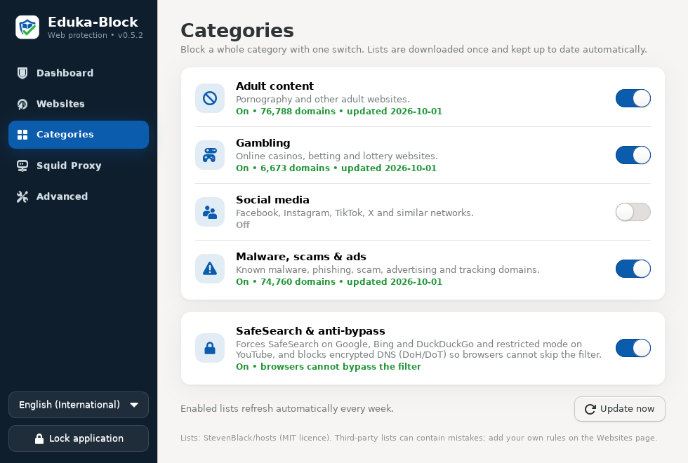
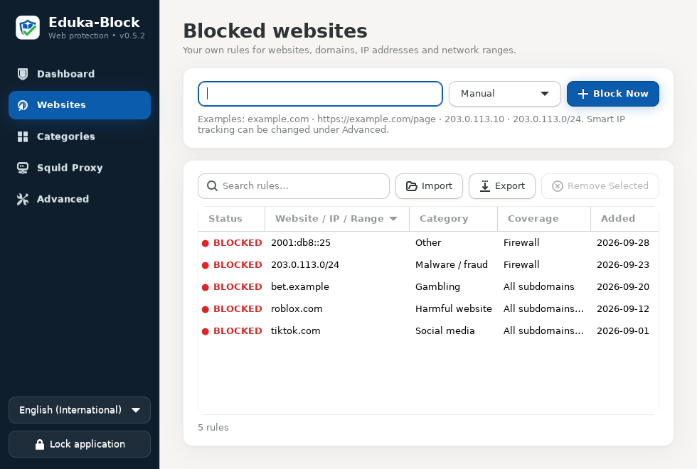
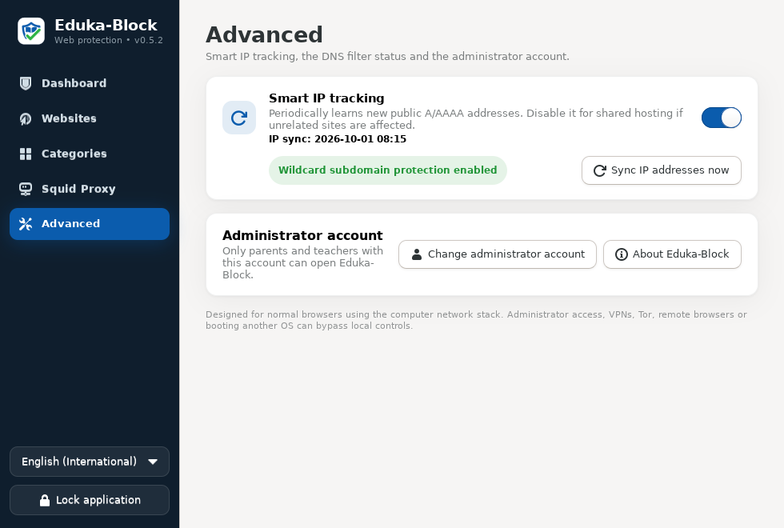
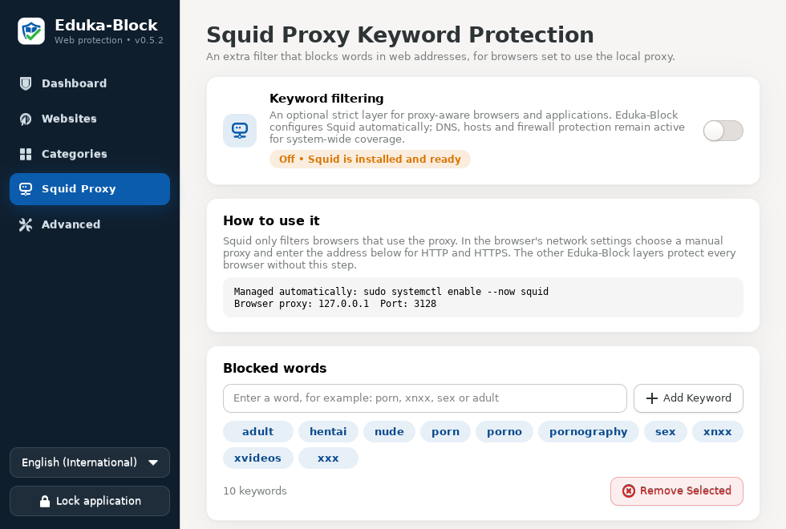
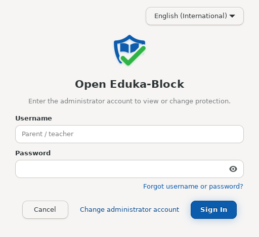
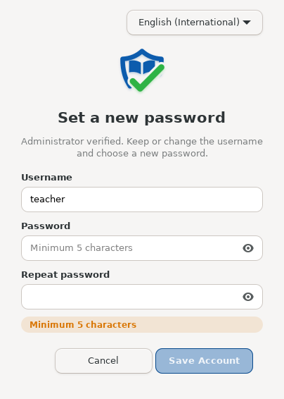

<p align="center"></p>

# Eduka-Block 0.5.2

Eduka-Block is the parental and school web-protection app for **Edukasaun OS**. Parents and teachers use it to block pornography, gambling, malware, scams, social media and any other website, domain, IP address or network range that is harmful to children and students. It works for every user and every normal browser on the computer.



## What's new in 0.5.2

- **The subdomain DNS filter now works on systems that use systemd-resolved** (`/etc/resolv.conf` → `127.0.0.53`), as most Ubuntu-based desktops do. Before, those systems never asked the filter, so only `/etc/hosts` protected them: `tiktok.com` and `www.tiktok.com` were blocked, but other subdomains and the platform's other domains were not. Eduka-Block now routes systemd-resolved through the filter, but only after a health check proves that the filter answers. If the filter stops, the route is removed at once, so the internet never breaks.
- **Platform families**: blocking `tiktok.com` also blocks `tiktokv.com`, `tiktokcdn.com`, `ttwstatic.com`, `byteoversea.com` and the rest of TikTok's domains. The same works for Facebook, Instagram, YouTube, X/Twitter, Snapchat, Discord, Roblox, Reddit, WhatsApp, Telegram, Twitch, Pinterest and Threads.
- New rules take effect at once: DNS caches are flushed after every change.
- **Turn on and Turn off**: the dashboard shows *Turn off protection* when protection is on. It turns off every category list and strict mode; your own website rules stay blocked.
- **Squid Proxy has its own page** with status, setup instructions and the blocked words.

## What's new in 0.5.1

- **Official logo**: a shield (protection) holding an open book (education), crossed by a green check (safe browsing). The interface now uses the logo's blue and green.
- **Forgot username or password?** on the sign-in screen, and the `sudo eduka-block-reset` terminal tool (see [Forgotten username or password](#forgotten-username-or-password)).
- **Image builders**: installing the `.deb` in Cubic or any chroot only prepares the system; protection starts at the image's first boot (see [Installing in Cubic](#installing-in-edukasaun-os-with-cubic)).

## What's new in 0.5.0

- **New interface**: a sidebar with four pages (Dashboard, Websites, Categories, Advanced), a clear protection status, and short notifications instead of extra dialogs.
- **One-click protection**: *Turn on recommended protection* blocks adult content, gambling and malware, and turns on SafeSearch and anti-bypass, with a single administrator prompt.
- **Category lists**: Adult content, Gambling, Social media and Malware/scams/ads, about 160,000 domains in total. Each one is turned on with one switch and refreshed automatically every week.
- **SafeSearch and anti-bypass (strict mode)**:
  - Google, Bing and DuckDuckGo are forced to SafeSearch, and YouTube to Restricted Mode.
  - Encrypted DNS (DNS-over-HTTPS / DNS-over-TLS), which lets browsers skip DNS filtering, is blocked.
  - Browser policies for Firefox, Chromium, Chrome, Brave and Edge are installed.
- **Stronger website rules**: a pasted `https://www.example.com/...` now blocks `example.com` and every subdomain.
- **Single-file offline installer**: Eduka-Block plus every dependency in one `.run` file, for computers without internet (see [Installation](#installation)).

## Screenshots

| First start | Categories |
| --- | --- |
|  |  |
| **Websites** | **Advanced** |
|  |  |

| **Squid Proxy** | |
|  | |
| **Sign-in** | **Account recovery** |
|  |  |

## How the protection works

Eduka-Block works below the browser, at the operating-system level. Each layer covers a gap left by the others:

| Layer | What it does |
| --- | --- |
| Wildcard DNS (NetworkManager + dnsmasq) | Blocks a domain and **all** of its subdomains. Category lists are served here when dnsmasq is the resolver. |
| `/etc/hosts` section | Fallback when dnsmasq is not active. It also holds the SafeSearch addresses. |
| nftables firewall | Blocks IP addresses and ranges, and IP addresses learned from blocked domains (Smart IP tracking). |
| Category lists | Adult, gambling, social media and malware lists from [StevenBlack/hosts](https://github.com/StevenBlack/hosts), validated and refreshed weekly. |
| SafeSearch | Pins Google, Bing, DuckDuckGo and YouTube to their restricted endpoints. |
| Anti-bypass | Blocks known DNS-over-HTTPS resolvers (DNS and HTTPS) and all DNS-over-TLS (port 853). It also answers Firefox's DoH canary domain with NXDOMAIN. Plain DNS keeps working. |
| Browser policies | Firefox: DNS-over-HTTPS disabled and locked. Chromium/Chrome/Brave/Edge: DoH off, SafeSearch, YouTube Restricted Mode and the SafeSites adult filter. |
| Squid proxy (optional) | Blocks keywords in URLs for browsers configured to use `127.0.0.1:3128`. |

With **recommended protection** turned on, normal browsers cannot reach blocked sites, cannot switch to encrypted DNS to get around the filter, and always get filtered search results.

No local filter can be 100% bulletproof against someone who has the administrator (root) password, boots another operating system, or uses a VPN, Tor or a remote browser. **Give children and students a normal (non-administrator) Linux account.**

## Using Eduka-Block

1. Open **System → Eduka-Block**. On the first start, create the parent/teacher account (password: at least 5 characters, typed twice).
2. On the **Dashboard**, click **Turn on recommended protection**.
3. To block one more site, type it in **Block a website** and press **Block Now**.
4. Use **Categories** to turn individual lists on or off (for example, Social media for school computers).
5. Use **Websites** to search, import, export and remove your own rules. Select several rules with Ctrl/Shift and press **Delete**.

The app locks itself after 10 minutes without activity (**Ctrl+L** locks it immediately; **Ctrl+F** searches the rules). Every change asks for the operating-system administrator password through PolicyKit.

## A blocked site still opens: checklist

1. **Dashboard → Protection layers**: *Subdomain DNS filter* should be ✓. If it shows ✗, open **Advanced → Sync IP addresses now**, or restart the computer once after installing. The filter starts after NetworkManager has loaded its DNS plugin.
2. Turn on **SafeSearch & anti-bypass** (or *Turn on recommended protection*). Without it, a browser that uses encrypted DNS skips every DNS rule.
3. Close and reopen the browser. Already-open connections can keep working for a short time after a site is blocked.
4. Make sure children use a **normal (non-administrator)** account: an administrator can change or remove any local protection.

## Forgotten username or password

The Eduka-Block account protects the app from children and students. The real security boundary is the computer's **administrator (sudo) password**: every change to the protection already needs it. So whoever knows the administrator password can recover the Eduka-Block account. Protection rules are never changed by a recovery.

**On the sign-in screen**

1. Click **Forgot username or password?**
2. Choose **Continue as administrator** and enter the computer's administrator password in the system prompt.
3. Eduka-Block shows the stored username. Keep or change it, type a new password twice, and click **Save Account**.

**In a terminal** (also over SSH, or when the graphical prompt is not available)

```bash
sudo eduka-block-reset                  # shows the username, asks for a new password
sudo eduka-block-reset --show-username  # only prints the username
sudo eduka-block-reset --remove         # deletes the account; the next start asks to create a new one
```

The password itself cannot be shown. Only a salted PBKDF2-SHA256 hash is stored in `/usr/share/Eduka-Block/credentials.txt`.

If nobody knows the administrator password either, it must be reset first with the operating system's own recovery procedure (for example, the recovery mode boot menu). This is intentional: otherwise a student could remove the protection.

## Installation

### With internet (recommended)

```bash
sudo apt install ./eduka-block_0.5.2-1_all.deb
```

APT downloads the dependencies automatically. Upgrading from an older version keeps the account and all rules.

### Installing in Edukasaun OS with Cubic

To include Eduka-Block in a customised Edukasaun OS ISO, build the package (or download it from the CI artifacts/releases) and install it in **Cubic's terminal** page:

1. Drag `eduka-block_0.5.2-1_all.deb` into the Cubic terminal window. Cubic copies it into the image's current directory.
2. Install it with its dependencies (Cubic's chroot has internet access):

   ```bash
   apt update
   apt install -y ./eduka-block_0.5.2-1_all.deb
   ```

3. The installer prints `Eduka-Block: installed into an image; protection starts at the first boot.` Nothing is started inside Cubic, and the host's NetworkManager and services are never touched.
4. Continue in Cubic and generate the ISO. On every computer installed from it, `eduka-block-firewall.service` and `eduka-block-sync.timer` start at boot. Strict mode (SafeSearch and anti-bypass) is active immediately. When Eduka-Block is opened the first time, it asks the parent or teacher to create the account.

To check the result in the Cubic terminal:

```bash
dpkg -l eduka-block
systemctl is-enabled eduka-block-firewall.service eduka-block-sync.timer   # both: enabled
```

Each installed computer gets its own Eduka-Block account. Do not copy `credentials.txt` into the image unless every computer should share one parent/teacher password.

### Without internet: single-file installer

`eduka-block-0.5.2-offline-trixie-amd64.run` contains Eduka-Block **and every dependency** as a small local package repository:

```bash
sudo sh eduka-block-0.5.2-offline-trixie-amd64.run
```

- APT installs only what the computer is missing, and never downgrades packages.
- If the computer lacks something that the bundle does not contain, the installer falls back to the internet. Use `--offline-only` to prevent that, or `--extract DIR` to inspect the contents.
- Check the download with the accompanying `.sha256` file: `sha256sum -c eduka-block-0.5.2-offline-trixie-amd64.run.sha256`.

CI builds the offline installer for Debian 13 (Edukasaun OS) inside a `debian:trixie` container on every push. It also tests the installer on a clean minimal Debian 13, and attaches it to the GitHub release when a `v*` tag is pushed. To build it yourself on a Debian 13 machine or container:

```bash
sudo apt install dpkg-dev
./build.sh
sudo tools/build-offline-bundle.sh
```

### Dependencies

`python3`, `python3-gi`, `python3-dnspython`, `gir1.2-gtk-3.0`, `pkexec`, `polkitd`, `nftables`, `network-manager`, `dnsmasq-base`, `squid` and `ca-certificates`. `lxqt-policykit` is recommended for Eduka-Desktop/LXQt.

## Languages

English (International) is the default. Tetum, Português (Portugal), Português (Brasil) and Bahasa Indonesia can be chosen in the sign-in window or in the sidebar. The choice is saved per user in `~/.config/eduka-block/settings.json`.

## System files

| Path | Purpose |
| --- | --- |
| `/usr/share/Eduka-Block/credentials.txt` | Username, salt and PBKDF2-SHA256 password hash (never the password) |
| `/usr/sbin/eduka-block-reset` | Terminal account recovery (root only) |
| `/var/lib/eduka-block/blocklist.json` | Rules and settings (schema 4) |
| `/var/lib/eduka-block/<category>-domains.txt` | Cached category lists |
| `/etc/hosts` | Managed Eduka-Block section |
| `/etc/NetworkManager/conf.d/90-eduka-block-dns.conf` | Turns on NetworkManager's dnsmasq plugin |
| `/etc/NetworkManager/dnsmasq.d/eduka-block.conf` | Wildcard rules, DoH blocks, Firefox canary |
| `/etc/NetworkManager/dnsmasq.d/eduka-block-lists.conf` | Category lists (when dnsmasq is the resolver) |
| `/etc/systemd/resolved.conf.d/eduka-block.conf` | Routes systemd-resolved through the filter (only while the filter answers) |
| `/etc/firefox/policies/policies.json` | Firefox policy (merged; your other policies are kept and restored) |
| `/etc/{chromium,opt/chrome,brave,opt/edge,...}/policies/managed/eduka-block.json` | Chromium-family policies |
| nftables table `inet eduka_block` | IP/range blocks and anti-bypass rules |
| `eduka-block-firewall.service` | Restores protection at boot |
| `eduka-block-sync.timer` | Every 15 minutes: Smart IP, SafeSearch addresses, weekly list refresh |
| `/etc/squid/eduka-block.conf` | Optional Squid keyword ACL |

## Development

```bash
./build.sh                                      # dist/eduka-block_0.5.2-1_all.deb
python3 -m unittest discover -s tests -v        # GTK smoke test runs when GTK + a display exist
xvfb-run -a python3 -m unittest discover -s tests -v
python3 src/eduka_block.py                      # interface from the source tree (the helper must be installed)
```

The version lives only in `src/eduka_block_common.py` (`APP_VERSION`). The tests run every helper operation inside a temporary directory, so they never change the real `/etc/hosts`, firewall or browser policies, even when run as root.

## Removal

```bash
sudo apt remove eduka-block   # removes all blocking, keeps rules and account for reinstallation
sudo apt purge eduka-block    # removes everything
```

## Project

- Name: **Eduka-Block**, version **0.5.2** (package **0.5.2-1**)
- Target: Edukasaun OS (Debian 13) with Eduka-Desktop/LXQt
- Developer: **STI-MCAS & IDEA** · Project lead: **Hugo Moniz do Rego**
- Website: <https://edukasaunos.tl> · Licence: GPL-3.0-or-later
- Category lists: StevenBlack/hosts (MIT)
